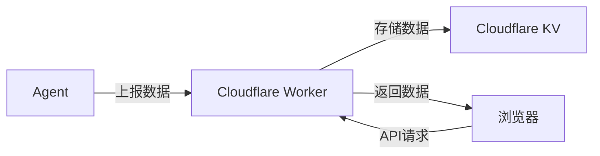

# 服务器探针Monitor端 - Serverless版

使用Cloudflare Workers和Cloudflare KV实现。

通过使用第三方serverless服务, 可以避免监控服务器崩溃造成单点故障。

> 整套探针系统结构如下



## 部署说明

1. 创建一个名为`SERVER_STATUS`的KV命名空间。
2. 创建一个Worker, 将`index.js`的内容粘贴进去。
3. 在Worker的`设置` -> `变量和机密`中配置两个环境变量`AUTH_KEY`(数据上报密钥)和`DATA_RETENTION_DAYS`(数据保留天数)。
4. 在Worker的`设置` -> `域和路由`中添加一个自己的域名。
5. 在Worker的`绑定`中把刚创建的KV命名空间绑定到`SERVER_STATUS`变量。
6. 记下`域和路由`中绑定的域名和环境变量`AUTH_KEY`的值, 用于Agent端的配置。

## API接口

### 1. 上报数据接口

```
POST /report
```

请求头：
```
Content-Type: application/json
Authorization: Bearer <auth-key>
```

请求体格式参考agent的数据格式。

### 2. 查询服务器列表

```
GET /api/servers
```

返回示例：
```json
[
  {
    "id": "server-01",
    "hostname": "web-server",
    "ip": "192.168.1.100",
    "last_seen": 1623456789000
  }
]
```

### 3. 查询服务器最新状态

```
GET /api/servers/{server_id}/status
```

返回最新的监控数据。

### 4. 查询服务器历史数据

```
GET /api/servers/{server_id}/history?start={timestamp}&end={timestamp}
```

参数：
- start: 开始时间戳（毫秒）
- end: 结束时间戳（毫秒）

返回指定时间范围内的历史数据数组。